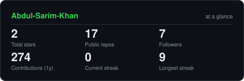

<div align="center">

<!-- PORTRAIT - generated by scripts/dotify.py from assets/your_photo.png.
     Regenerate anytime with:
       python scripts/dotify.py assets/your_photo.png -o assets/portrait \
         --cols 100 --equalize --detail 0.5 --color --reveal -->


<br>

<!-- NAME / TAGLINE - animated typing -->
<a href="https://github.com/Abdul-Sarim-Khan">
  
</a>

<br>

<!-- SOCIALS -->
<a href="https://linkedin.com/in/Abdul-Sarim-Khan"></a>
<a href="mailto:abdulsarimkhan5002@gmail.com"></a>
<a href="https://github.com/Abdul-Sarim-Khan"></a>
<a href="https://huggingface.co/KnuckleHead1/spaces"></a>

</div>

---

## `~/` whoami

```console
$ cat about.txt
```

Hi, I'm **Abdul Sarim Khan**. I'm a Computer Science undergraduate (CGPA **3.87 / 4.00**) specializing in **Network Security, Threat Intelligence, and Cloud Architecture**. I build decentralized detection pipelines, design international CTF challenges, and harden critical infrastructure.

- Creator & Architect of **[FLARE](https://github.com/Abdul-Sarim-Khan/FLARE)** — Distributed XDR system with Federated Learning & Protobuf binary protocols
- Senior Administrator & Challenge Creator for **Cyber Trihack Challenge CTF 2026** (tri-university collaboration: APU Malaysia & ENSIIE France)
- First-authored research: **Adaptive Priority Partitioning (APP)** for secure & priority-aware routing (submitted to *Operations Research Forum*)
- Certifications: **CLLMSE** (Certified LLM Security Expert), **CEH (Grade A)**, **Cisco CyberOps Operations Fundamentals**
- Honors: **93.3th Percentile** in National Skill Competency Test (NSCT) & Top 5% in **Uraan AI Techathon**
- Active Student Member, **IEEE** (Information Theory Society, ComSoc, Computer Society)

<br>

<div align="center">

## `~/` toolbox


</div>

---

<div align="center">

## `~/` skill radar

<table>
<tr>
<td width="50%" align="center" valign="middle">

<!-- Self-rated radar - edit assets/skills.json, the workflow redraws it -->
<picture>
  <source media="(prefers-color-scheme: dark)"  srcset="assets/radar-dark.svg">
  <source media="(prefers-color-scheme: light)" srcset="assets/radar-light.svg">
  
</picture>

</td>
<td width="50%" align="center" valign="middle">

<!-- Live radar built from real language byte counts across your repos -->
<picture>
  <source media="(prefers-color-scheme: dark)"  srcset="assets/radar-langs-dark.svg">
  <source media="(prefers-color-scheme: light)" srcset="assets/radar-langs-light.svg">
  
</picture>

</td>
</tr>
</table>

</div>

---

<div align="center">

## `~/` contribution graph

<!-- Snake eats the contribution graph - .github/workflows/snake.yml -->
<picture>
  <source media="(prefers-color-scheme: dark)"  srcset="https://raw.githubusercontent.com/Abdul-Sarim-Khan/Abdul-Sarim-Khan/output/snake-dark.svg">
  <source media="(prefers-color-scheme: light)" srcset="https://raw.githubusercontent.com/Abdul-Sarim-Khan/Abdul-Sarim-Khan/output/snake.svg">
  
</picture>

</div>

---

<div align="center">

## `~/` the numbers

<!-- Generated by scripts/cards.py into this repo. -->
<picture>
  <source media="(prefers-color-scheme: dark)"  srcset="assets/card-stats-dark.svg">
  <source media="(prefers-color-scheme: light)" srcset="assets/card-stats-light.svg">
  
</picture>

<br>


</div>

---

<div align="center">

<sub><em>"Hardening infrastructure, analyzing threats, and building resilient systems."</em></sub>

</div>
