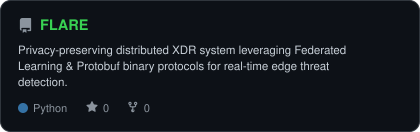
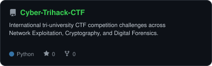
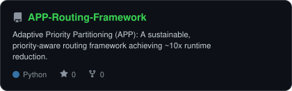
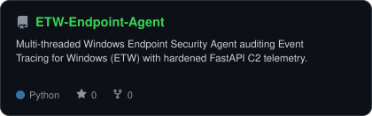

<div align="center">

<!-- PORTRAIT - generated by scripts/dotify.py from assets/your_photo.png.
     Regenerate anytime with:
       python scripts/dotify.py assets/your_photo.png -o assets/portrait \
         --cols 100 --equalize --detail 0.5 --color --reveal -->


<br>

<!-- NAME / TAGLINE - animated typing -->
<a href="https://github.com/Abdul-Sarim-Khan">
  
</a>

<br>

<!-- SOCIALS & CREDENTIALS -->
<a href="https://linkedin.com/in/Abdul-Sarim-Khan"></a>
<a href="mailto:abdulsarimkhan5002@gmail.com"></a>
<a href="https://github.com/Abdul-Sarim-Khan"></a>
<a href="https://tryhackme.com"></a>
<a href="https://cisco.com"></a>


</div>

---

## `~/` whoami

```console
$ cat about.txt
```

Hi, I'm **Abdul Sarim Khan**. I'm a Computer Science undergraduate (CGPA **3.87 / 4.00**) specializing in **Network Security, Threat Intelligence, and Cloud Architecture**. I build decentralized detection pipelines, design international CTF challenges, and harden critical infrastructure.

- 🛡️ Currently engineering **[FLARE](https://github.com/Abdul-Sarim-Khan/FLARE)** — Distributed XDR system with Federated Learning & Protobuf binary protocols
- 🚩 Senior Administrator & Challenge Creator for **Cyber Trihack Challenge CTF 2026** (tri-university collaboration: APU Malaysia & ENSIIE France)
- 🔬 First-authored research: **Adaptive Priority Partitioning (APP)** for secure & priority-aware routing (submitted to *Operations Research Forum*)
- 📜 Certifications: **CLLMSE** (Certified LLM Security Expert), **CEH (Grade A)**, **Cisco CyberOps Operations Fundamentals**
- 🏆 Honors: Admitted to **CyberMACS European Joint Master's Programme**, **93.3th Percentile** in National Skill Competency Test (NSCT), Top 5% in **Uraan AI Techathon**
- 🌐 Active Student Member, **IEEE** (Information Theory Society, ComSoc, Computer Society)

<br>

<div align="center">

## `~/` toolbox


</div>

---

<div align="center">

## `~/` skill radar

<table>
<tr>
<td width="50%" align="center" valign="middle">

<!-- Self-rated radar - edit assets/skills.json, the workflow redraws it -->
<picture>
  <source media="(prefers-color-scheme: dark)"  srcset="assets/radar-dark.svg">
  <source media="(prefers-color-scheme: light)" srcset="assets/radar-light.svg">
  
</picture>

</td>
<td width="50%" align="center" valign="middle">

<!-- Live radar built from real language byte counts across your repos -->
<picture>
  <source media="(prefers-color-scheme: dark)"  srcset="assets/radar-langs-dark.svg">
  <source media="(prefers-color-scheme: light)" srcset="assets/radar-langs-light.svg">
  
</picture>

</td>
</tr>
</table>

</div>

---

<div align="center">

## `~/` contribution calendar

<!-- 3D isometric calendar, regenerated every 6h by .github/workflows/metrics.yml -->


<br><br>

<!-- Snake eats the contribution graph - .github/workflows/snake.yml -->
<picture>
  <source media="(prefers-color-scheme: dark)"  srcset="https://raw.githubusercontent.com/Abdul-Sarim-Khan/Abdul-Sarim-Khan/output/snake-dark.svg">
  <source media="(prefers-color-scheme: light)" srcset="https://raw.githubusercontent.com/Abdul-Sarim-Khan/Abdul-Sarim-Khan/output/snake.svg">
  
</picture>

</div>

---

<div align="center">

## `~/` the numbers

<!-- Generated by scripts/cards.py into this repo. -->
<picture>
  <source media="(prefers-color-scheme: dark)"  srcset="assets/card-stats-dark.svg">
  <source media="(prefers-color-scheme: light)" srcset="assets/card-stats-light.svg">
  
</picture>

<br>


<br><br>


</div>

---

<div align="center">

## `~/` selected work

<!-- Cards generated by scripts/cards.py from assets/projects.json. -->
<table>
<tr>
<td width="50%">
  <a href="https://github.com/Abdul-Sarim-Khan/FLARE">
    <picture>
      <source media="(prefers-color-scheme: dark)"  srcset="assets/card-FLARE-dark.svg">
      <source media="(prefers-color-scheme: light)" srcset="assets/card-FLARE-light.svg">
      
    </picture>
  </a>
</td>
<td width="50%">
  <a href="https://github.com/Abdul-Sarim-Khan/Cyber-Trihack-CTF">
    <picture>
      <source media="(prefers-color-scheme: dark)"  srcset="assets/card-Cyber-Trihack-CTF-dark.svg">
      <source media="(prefers-color-scheme: light)" srcset="assets/card-Cyber-Trihack-CTF-light.svg">
      
    </picture>
  </a>
</td>
</tr>
<tr>
<td width="50%">
  <a href="https://github.com/Abdul-Sarim-Khan/APP-Routing-Framework">
    <picture>
      <source media="(prefers-color-scheme: dark)"  srcset="assets/card-APP-Routing-Framework-dark.svg">
      <source media="(prefers-color-scheme: light)" srcset="assets/card-APP-Routing-Framework-light.svg">
      
    </picture>
  </a>
</td>
<td width="50%">
  <a href="https://github.com/Abdul-Sarim-Khan/ETW-Endpoint-Agent">
    <picture>
      <source media="(prefers-color-scheme: dark)"  srcset="assets/card-ETW-Endpoint-Agent-dark.svg">
      <source media="(prefers-color-scheme: light)" srcset="assets/card-ETW-Endpoint-Agent-light.svg">
      
    </picture>
  </a>
</td>
</tr>
</table>

<sub>

| project | focus | stack |
|---|---|---|
| **[FLARE](https://github.com/Abdul-Sarim-Khan/FLARE)** | Distributed XDR & Edge Threat Detection | `Python` `FastAPI` `Protobuf` `ETW` |
| **[Cyber-Trihack-CTF](https://github.com/Abdul-Sarim-Khan/Cyber-Trihack-CTF)** | Tri-University International CTF | `Network Exploitation` `Cryptography` `Digital Forensics` |
| **[APP-Routing-Framework](https://github.com/Abdul-Sarim-Khan/APP-Routing-Framework)** | Sustainable Priority Routing Algorithm | `Python` `Algorithms` `TSPLIB` |
| **[ETW-Endpoint-Agent](https://github.com/Abdul-Sarim-Khan/ETW-Endpoint-Agent)** | Windows Telemetry & C2 Audit Pipeline | `PowerShell` `C++` `ETW` `FastAPI` |

</sub>

</div>

---

<div align="center">

<sub>`01110011 01100101 01100011 01110101 01110010 01101001 01110100 01111001 00100000 01100011 01101100 01100101 01100001 01110010 01100101 01100100`</sub>

</div>
